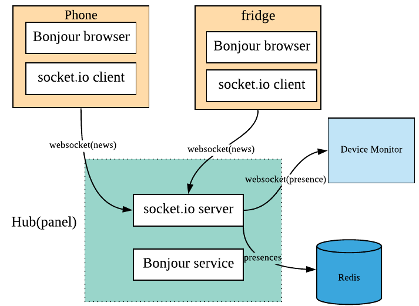
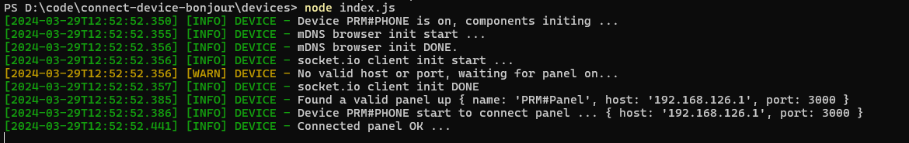
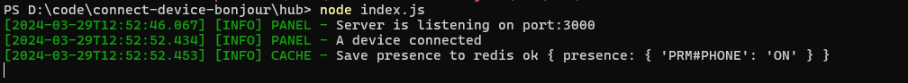
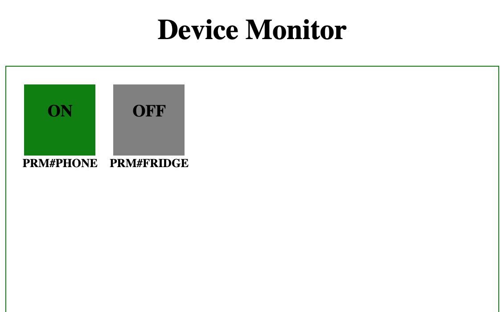

# connect-device-bonjour
Main goals:

- Devices in the local network can do device paring with mDNS.
- Devices can connect to the hub device via websocket.
- Hub device can hold presence of device with Redis.
- Dockerization: build the service into docker image.

## Prerequisites

Some stuffs you should get to know first.

### mDNS

In IoT, device paring is a normal but challenging thing. But how can a device connect other devices in the local network? Maybe we should know the ip and port of the device. But usually, IPs are allocated by [DHCP](<https://en.wikipedia.org/wiki/DHCP_(disambiguation)>), so they are dynamic.How can I get IP of the specific device by its name? Yes, mDNS can do it.  
[mDNS](https://en.wikipedia.org/wiki/Multicast_DNS)(Multicast DNS), is also known as **ZeroConf** or **bonjour**. A device with mDNS will advertize in the local network by publishing its infomation(ip,port,serviceType...) with UDP. Also devices can query services with a specific service type. More info about mDNS, see the [specification](https://tools.ietf.org/html/rfc6762).  
In our case, we need a npm module. [bonjour](https://github.com/watson/bonjour) and [mdns](https://github.com/agnat/node_mdns) both are good choices. We choose **mdns**, as its better documentation.

> Finally, I choose bonjour instead. Because mdns depends on avahi service. see the [issue](https://github.com/agnat/node_mdns/issues/227). It is a tough thing, although it can be solved. Another reason is, the docker image based on mdns is too large, so I choose bonjour instead.

### WebSocket

I  use [socket.io](https://socket.io/docs/) to do our websocket thing here. You can learn a lot from its documentation.

### Redis

Redis is also our common tool. You can set it up and play with it easily.
I always set it up with docker for convenience.
### Architecture

The system has two roles: **hub** and **device**.

- Hub  
  Hub integrate a bonjour service to advertise in the network. And it lift a socket.io server to wait for the device connecting.Upon connecting, hub will save a presence to redis.

- device  
  The devices like phone or fridge will integrate a bonjour browser, which search a hub in the network. Once find one, it will connect the hub with websocket.

 I will setup two devices(one phone and one fridge)and one hub(one panel), as follow picture.

<div align=center>  </div>


### Sequence diagram

TODO

### Daemon

#### step 1: set up the  device

A little restriction about deviceName, which should prefix with **PRM#**. 

Here is my shell command device 
<div align=left>  </div>
<<<<<<< HEAD

=======
>>>>>>> a3e75483cfba781f0d4d33be4b9321ec329ac5bc

* Note: setup env ( i use window)

```shell
set NODE_ENV=DEV
set DEVNAME=PRM#PHONE
```

#### step 2: set up hub
First run Redis Server If you have not, you may get the following error, refer  [here](https://github.com/tlaverdure/laravel-echo-server/issues/369). Another way,  run redis server like docker container under Window ( i run redis server with WSL)

The panel will set up and advertise in the network. Upon panel`s up and down, the phone and fridge will know it.

<div align=left>  </div>

#### step 3: device monitor

While we setting up the hub, we also serve a simple page for view the device presence. Open ur browser and input the url. **http://[your hub host ip]:3000**. And you will see the presence in a real time. Green is online, gray is offline.And you can try to crash some device daemon. The device will be gray.

<div align=center>  </div>

Here, phone is online, and fridge is offline.